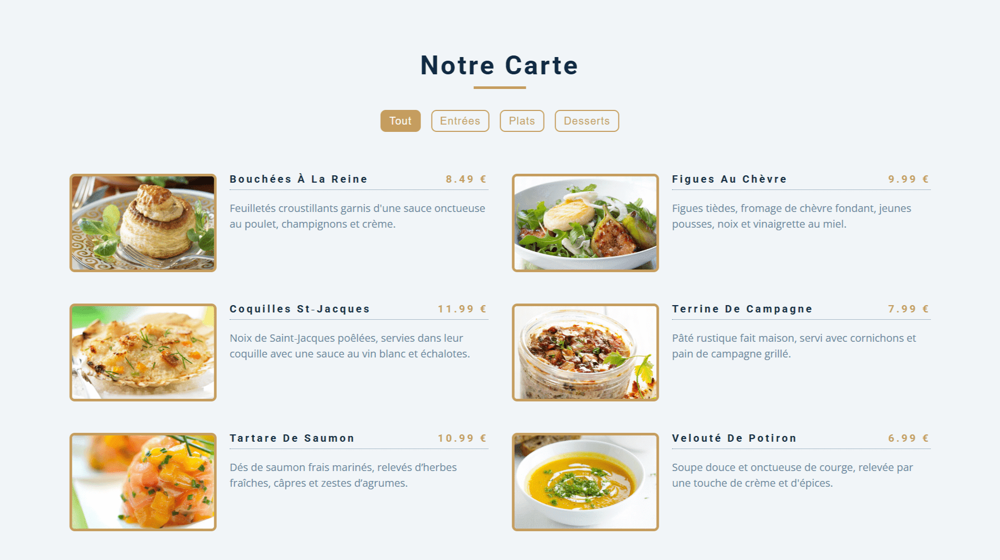

<div align="center">
  <a href="https://carousel-menu.netlify.app/" target="_blank">
    
  </a>
  </br></br>
  <h3 align="center">🍽️ Carousel Menu &nbsp;–&nbsp; Carte Filtrable</h3>
</div>

## <br /> 📌 Sommaire

&nbsp;&nbsp;&nbsp; 🎨 &nbsp; [**Introduction**](#introduction)<br />
&nbsp;&nbsp;&nbsp; 🛠️ &nbsp; [**Technologies**](#technologies)<br />
&nbsp;&nbsp;&nbsp; 🎯 &nbsp; [**Fonctionnalités**](#fonctionnalités)<br />
&nbsp;&nbsp;&nbsp; 🚀 &nbsp; [**Installation**](#installation)<br />

## <br /> <a name="introduction">🎨 Introduction</a>

Menu interactif filtrable par catégories avec génération dynamique des éléments depuis un tableau JavaScript. Chaque plat est présenté sous forme de carte élégante, avec image, titre, prix et description.

La grille responsive, combinée à des animations de survol fluides, offre une expérience utilisateur soignée et adaptable à tous les écrans.

Parfait pour les restaurants en ligne, les menus digitaux ou toute galerie de produits organisés par thème ou catégorie.

## <br /> <a name="technologies">🛠️ Technologies</a>

- HTML5 sémantique et accessible
- CSS3 moderne avec variables, media queries et transitions
- JavaScript ES6 clair et modulaire
- Manipulation du DOM sans librairie
- [Font Awesome](https://fontawesome.com/) pour les icônes
- Responsive mobile-first

## <br /> <a name="fonctionnalités">🎯 Fonctionnalités</a>

- Filtres dynamiques (tout, entrées, plats et desserts)
- Composants injectés dynamiquement depuis un tableau
- Boutons interactifs avec état actif
- Design responsive pour toutes tailles d’écran
- Animation au survol sur les cartes
- Organisation claire des plats
- Filtres accessibles et intuitifs
- Structure modulaire et facilement réutilisable

## <br /> <a name="installation">🚀 Installation</a>

### ✅ Prérequis

- [Google Chrome](https://www.google.com/) &nbsp;—&nbsp; Navigateur moderne
- [Visual Studio Code](https://code.visualstudio.com/) &nbsp;—&nbsp; Éditeur de code
- [Live Server](https://marketplace.visualstudio.com/items?itemName=ritwickdey.LiveServer) &nbsp;—&nbsp; Extension VS Code

### 📥 Cloner le projet

```bash
git clone https://github.com/ValentinMadiot/carousel-menu_js
cd carousel-menu_js
```

### ▶️ Lancer le projet

Il suffit d’ouvrir le fichier `index.html` dans un navigateur, ou d’utiliser l’extension **Live Server** sur VS Code pour un aperçu dynamique.
